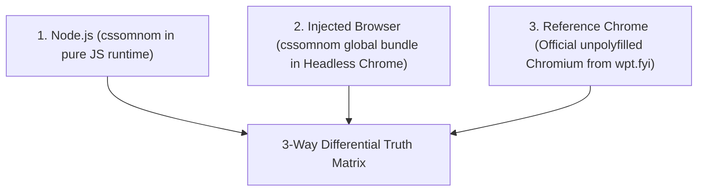
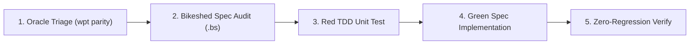

# WPT Conformance & 3-Way Differential Parity Oracle Guide

This skill guides agents on measuring, triaging, and systematically improving the spec conformance of `cssomnom` against the official W3C Web Platform Tests (WPT) and modern browser reference baselines.

---

## 1. The 3-Way Parity Oracle Truth Matrix

To avoid greenwashing and distinguish between genuine implementation bugs, browser shortcomings, and physical Node.js limitations, we evaluate every WPT subtest across **3 independent environments**:



| Truth Category | Node | Injected | Reference Chrome | Meaning & Action Required |
| :--- | :---: | :---: | :---: | :--- |
| **`VERIFIED_CONFORMANCE`** | PASS | PASS | PASS | **True positive conformance**. Both Node and Blink agree on standard spec behavior. |
| **`POLYFILL_IMPROVEMENT`** | PASS | PASS | FAIL | **Polyfill superiority**. `cssomnom` implements latest modern spec behavior (e.g. relaxed nesting, Syntax 3 escaping) where upstream Blink has legacy bugs. |
| **`VERIFIED_SPEC_GAP`** | FAIL | FAIL | PASS | **High-priority implementation gap**. Genuine bugs/missing features in `cssomnom` that must be fixed. |
| **`FEASIBILITY_BOUNDARY`** | FAIL | FAIL | FAIL | **Ecosystem boundary**. Tests asserting 2D geometry, GPU rasterization, or WebDriver input that are physically impossible in pure AST/DOM. Kept in [`wpt-browser-only-manifest.json`](./tests/fixtures/wpt-browser-only-manifest.json). |
| **`OVER_MOCKING_FALSE_POSITIVE`** | PASS | FAIL | FAIL | **Over-permissive shim bug**. Stubs in `tests/dom-shim/` or loose typechecks passing by accident. Must tighten WebIDL validation! |

---

## 2. CLI Tooling & Cache Pipeline

All conformance tooling is centralized in the unified `scripts/wpt/node/cli.ts` harness:

```bash
# 1. Run Node WPT test suite (updates .wpt-cache/last-run.json)
pnpm run wpt run --spec=cssom

# 2. Fetch latest reference Chrome master run from wpt.fyi API & GCS
pnpm run wpt fetch-upstream

# 3. Compute 3-Way Differential Parity Matrix across all or single spec
pnpm run wpt parity --filter-by-spec=cssom

# 4. View failure clusters & top discrepancy patterns
pnpm run wpt failures --spec=cssom

# 5. Verify monotonic zero-regression against baseline
pnpm run wpt:verify
```

### Runtime Cache Directory (`.wpt-cache/`)
* **`.wpt-cache/last-run.json`**: Stores the structured dataset (`TestRunDataset`) from the most recent Node test run (all 18,892 assertions).
* **`.wpt-cache/report-chrome-upstream.json`**: Cached official Reference Chrome run downloaded directly from `wpt.fyi` (122K+ tests / 2.25M subtests).

---

## 3. Workflow for Discovering & Fixing Failure Clusters

When assigned to improve conformance on a spec suite:



### Step 1: Empirical Failure Clustering
Never guess or inspect test logs manually. Query `.wpt-cache/last-run.json` to isolate exact failure clusters:
```bash
node -e '
const fs = require("fs");
const lastRun = JSON.parse(fs.readFileSync(".wpt-cache/last-run.json", "utf8"));
const upstream = JSON.parse(fs.readFileSync(".wpt-cache/report-chrome-upstream.json", "utf8"));
// Group subtest failures by file, error message, and expected vs actual diff
'
```

### Step 2: Consult Normative Specifications First
Before modifying code, ALWAYS open and inspect the Bikeshed source files (`.bs`) in `submodules/`:
* **CSSOM**: `submodules/csswg-drafts/cssom-1/Overview.bs`
* **CSS Syntax**: `submodules/csswg-drafts/css-syntax-3/Overview.bs`
* **CSS Values & Sizing**: `submodules/csswg-drafts/css-values-4/Overview.bs`
* **CSS Typed OM**: `submodules/css-houdini-drafts/css-typed-om/Overview.bs`
* **CSS Variables**: `submodules/csswg-drafts/css-variables-1/Overview.bs`
* **Selectors**: `submodules/csswg-drafts/selectors-4/Overview.bs`

### Step 3: Red/Green TDD
1. **Red**: Write an isolated unit test in `tests/<domain>.test.ts` reproducing the exact failure before touching `src/`.
2. **Green**: Implement the spec algorithm in `src/`.
3. **Spec Citations**: Add explicit code comments citing the spec section and anchor (e.g. `// cssom-1 § 6.5.3 #insert-a-css-rule`).

### Step 4: Verification & Conformance Commit
1. Run `pnpm run preflight` (ensures typecheck, oxlint, safe-exec guard, and unit tests pass 100%).
2. Run `pnpm run wpt:verify` to confirm zero regressions and measure newly passing assertions.
3. Commit with a clean, lowercase action message (e.g. `feat(cssom): implement all property expansion and pseudo element computed styles`).

---

## 4. Critical Architectural Gotchas ("Don't Fix Things in a Dumb Way")

### 1. LinkeDOM WeakMap Encapsulation (No Symbol Monkey-Patching)
* **Gotcha**: Direct symbol attachment on LinkeDOM's `CSSStyleDeclaration` instances does not propagate cleanly through internal prototypes.
* **Rule**: Always use `WeakMap` stores in `tests/dom-shim/src/dom-stubs.ts` (`customPropsStore`, `styleProxyMap`, `proxyToStyle`, `styleToElement`) to store custom properties and proxies without mutating LinkeDOM internal state.

### 2. Authentic WPT HTML Document Structure (No Synthetic HTML Wrappers)
* **Gotcha**: Wrapping WPT test markup in synthetic `<!DOCTYPE html><html><body>` strings breaks raw DOM structure, tagName casing, and heading selector assertions.
* **Rule**: Always pass raw WPT test HTML strings directly to LinkeDOM without artificial wrapper injections.

### 3. Circular Dependency Management (`ParseHooks`)
* **Gotcha**: Importing `Parser` directly into `src/CSSOM.ts` or `src/typed-om.ts` creates circular module cycles.
* **Rule**: Always use `ParseHooks.parseComponentValues()`, `ParseHooks.consumeRule()`, or `ParseHooks.parseStyleAttribute()`. Implementations are injected in `src/parser.ts`.

### 4. Strict WebIDL Type Checking & Rectification
* **Gotcha**: Coercing strings or accepting raw numbers in Typed OM constructors creates over-mocking false positives.
* **Rule**: Strictly adhere to WebIDL: throw `TypeError` when arguments are not instances of `CSSNumericValue` or required classes; throw `DOMException` `SyntaxError` on dimension or unit type mismatches.

### 5. Automation Over Hardcoding
* **Gotcha**: Hardcoding lists of CSS properties, shorthands, or units creates technical debt that diverges from standards.
* **Rule**: Use codegen scripts in `scripts/codegen/` derived from `@webref/css` and `mdn-data`. Include all scripts in `scripts/codegen/generate_all.ts`.

### 6. Machine Defense & Safe Execution
* **Gotcha**: Spawning unbounded `node:child_process` processes can exhaust memory, spawn zombies, or crash the machine.
* **Rule**: Direct imports of `child_process` are banned in `scripts/` and `tests/` and enforced via `check:safe-exec`. Always use `safeExecTestFile` and `safeWorkerPool` from `scripts/wpt/node/safe-child-process.ts` (constrained by `--max-old-space-size=512` and 250ms RSS watchdog).
