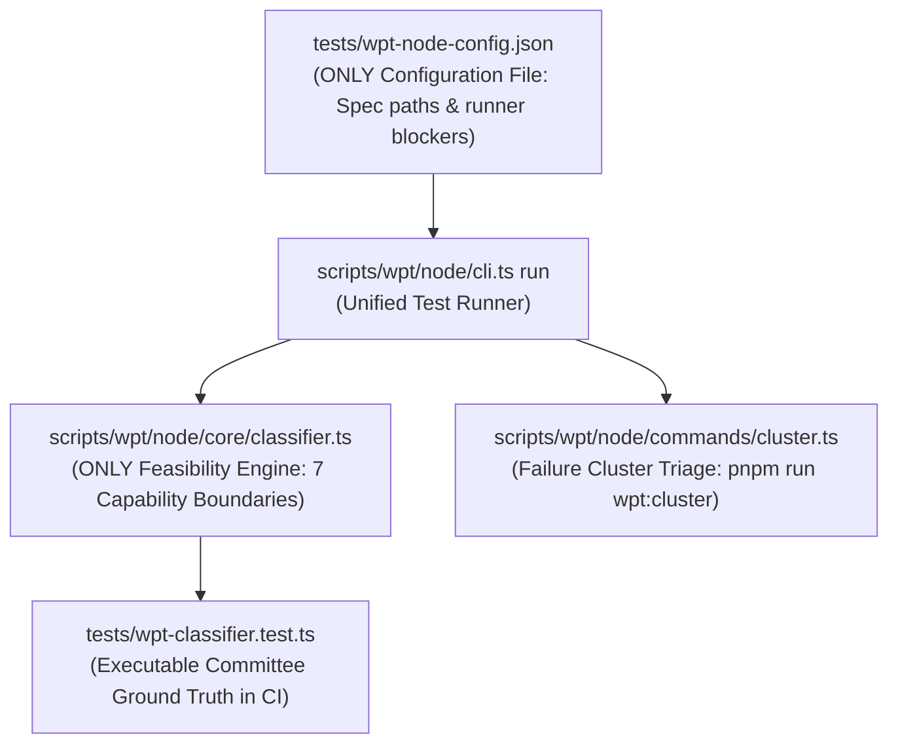

# WPT Node.js Conformance & Feasibility Architecture

This document describes the unified architecture for running W3C Web Platform Tests (WPT) in pure Node.js, how achievable ("feasible") conformance denominators are determined, what constitutes an out-of-scope test versus a genuine CSSOM bug, and how to maintain and triage these boundaries over time.

---

## 1. Conformance Principles & Anti-Greenwashing Invariants

`cssomnom` builds a spec-compliant CSS Object Model (CSSOM) and CSS Typed OM implementation in pure TypeScript.

- **Pure Node.js Environment**: Tests execute inside Node.js using an in-memory DOM ([LinkeDOM](https://github.com/WebReflection/linkedom)) without a visual browser layout engine, GPU rasterizer, OS windowing system, or live hardware input drivers.
- **Anti-Greenwashing Invariant**: We **never** declare a test "out of scope" simply because it is difficult, exposes a parser bug, or requires non-trivial AST manipulation. A test is considered out-of-scope **only if it is physically impossible to satisfy in headless Node.js without a full browser engine**.
- **Executable Ground Truth**: Ground truth is enforced by executable unit tests in [`tests/wpt-classifier.test.ts`](../../../tests/wpt-classifier.test.ts), not unmaintained static JSON catalogs that drift out of sync.

---

## 2. The Single Unified Architecture

All WPT test execution, failure clustering, and feasibility evaluation is consolidated into a single configuration and a single runtime engine:



### The Single Configuration File: `tests/wpt-node-config.json`
`tests/wpt-node-config.json` is the **only** configuration file in the repository. Its `exclude` list is strictly reserved for **Runner Blockers**:
1. **Visual Reftests**: Tests declaring `<link rel="match">` with 0 JavaScript assertions (requiring a pixel-rendering engine).
2. **VM Syntax/Loader Crashes**: Files containing `<script type="module">` which Node.js `vm.Script` cannot execute without ESM loader hooks, or upstream WPT syntax errors.
3. **Indefinite Timeouts**: Files that hang indefinitely waiting for external network servers or OS driver events.

> [!IMPORTANT]
> **Mixed Test Files**: Any test file containing pure-CSSOM assertions MUST NOT be excluded in `wpt-node-config.json`. Mixed files run in the test harness so their pure-CSSOM subtests pass and count toward conformance. Individual layout-dependent failures within those files are classified dynamically.

---

## 3. Mathematical Definitions & Denominators

To prevent denominator manipulation and ensure complete transparency, every test report displays both the **Raw Score** and the **Normalized Score** side-by-side:

| Metric | Symbol | Definition |
| :--- | :---: | :--- |
| **Total Subtests** | $N$ | Total subtest assertions executed across all in-scope WPT test suites. |
| **Passing Subtests** | $P$ | Verified passing assertion instances in pure Node.js (`pnpm run wpt:run`). |
| **Detected Browser-Only** | $E$ | Failed subtests dynamically classified as requiring unpolyfilled browser platform capabilities. |
| **Feasible Target** | $M$ | The fair, achievable Node.js target: $$M = \max(P, N - E)$$ |
| **Raw Pass Rate** | — | Percentage of all tested assertions passing: $$\text{Raw Score} = \frac{P}{N} \times 100$$ |
| **Normalized Conformance** | — | Percentage of achievable pure-Node assertions passing: $$\text{Normalized} = \min\left(100.00\%, \frac{P}{M} \times 100\right)$$ |

### Dimensional Purity Invariant
$P$, $N$, $E$, and $M$ are measured in **identical units: individual subtest assertions**. We never subtract file counts from subtest counts ($N_{\text{subtests}} - E_{\text{files}}$ is strictly banned).

---

## 4. The 7 Objective Browser Capability Boundaries

Failed subtests are classified by [`scripts/wpt/node/core/classifier.ts`](./core/classifier.ts) into seven explicit, objective categories:

### 1. `LAYOUT_GEOMETRY`
- **Definition**: Visual box model dimension resolution derived from font rasterization, inline text layout, line-height geometry, or flex/grid positioning.
- **Boundaries**:
  - `getComputedStyle(el).width`, `height`, `margin`, `padding`, `top`, `bottom`, `left`, `right`, `flex-basis`.
  - Triggered when expected value is a layout `px` dimension (`143.5px`) and actual is unset/fallback (`auto`, `0px`, `""`).
  - *In-Scope Contrast*: Declarative cascade tests calling `getComputedStyle(el).color`, `display`, `visibility`, or custom properties `--var` are pure CSSOM and MUST evaluate as in-scope.

### 2. `VIEWPORT_GEOMETRY`
- **Definition**: 2D screen coordinate calculations and spatial hit-testing.
- **Boundaries**:
  - `document.caretPositionFromPoint(x, y)`, `document.caretRangeFromPoint(x, y)`.
  - `element.getClientRects()`, `element.getBoundingClientRect()`.
  - `document.elementsFromPoint(x, y)`, `document.elementFromPoint(x, y)`.

### 3. `HARDWARE_INPUT_DRIVER`
- **Definition**: OS-level hardware input events and physical interaction heuristics.
- **Boundaries**:
  - `test_driver.action_sequence` (mouse clicks, pointer movement, touch gestures).
  - `:focus-visible` heuristics dependent on hardware keyboard vs. pointer modality.
  - `:active` mouse button press transitions and live `:hover`/`:focus` user actions.

### 4. `ANIMATION_SCHEDULER`
- **Definition**: Live time-sliced value interpolation over animation timeline frames.
- **Boundaries**:
  - `element.animate()` and `AnimationTimeline` requiring a browser animation frame clock.
  - `@keyframes` live transition rollbacks (`revert-layer` during active animations).

### 5. `CONTAINER_LAYOUT`
- **Definition**: `@container` queries requiring layout box inline or block dimension evaluation (`min-width`, `inline-size`, `cqw`, `cqh`).

### 6. `MODAL_TOP_LAYER`
- **Definition**: HTML5 window top-layer stacking and focus trapping (`<dialog showModal()>`, `::backdrop`, `:modal`).

### 7. `HTTP_CHARSET_STREAM`
- **Definition**: HTTP network transport header parsing, legacy character transcoding byte streams (`page-windows-1251-*`), and Resource Timing API network fetches.

---

## 5. Triage & Calibration Workflow: How to Re-evaluate Going Forward

When new WPT test suites are imported or when investigating remaining failures, follow this multi-step triage process:

```
[ Step 1: Cluster Failures ] ──> [ Step 2: Multi-Perspective Deliberation ] ──> [ Step 3: Actionable Resolution ]
 (pnpm run wpt:cluster)           (Scrutineer / Grizz / Architect)                    │
                                                                                      ├─► CSSOM Gap: Implement in src/
                                                                                      └─► Browser Boundary: Add to classifier.ts
                                                                                          + Regression test in tests/wpt-classifier.test.ts
```

### Step 1: Inspect Failure Signatures
Run the clustering tool to see grouped failure patterns across any spec suite:
```bash
# Cluster all failures across the entire WPT run
pnpm run wpt:cluster

# Or inspect a specific specification suite
pnpm run wpt:cluster --spec=selectors
```

### Step 2: Deliberate Across Three Perspectives (The Delphi Check)
Neither a regex heuristic nor an optimistic developer agent is an unquestioned authority. Evaluate ambiguous failure clusters through three distinct lenses:
1. **The Spec Scrutineer**: Consult the normative Bikeshed source (`submodules/csswg-drafts/**/*.bs`). Does the standard require pure AST resolution, or does the prose invoke layout/viewport algorithms?
2. **The Hostile Gatekeeper (Grizz)**: Challenge any claim of "browser-only". Can this assertion be satisfied by pure in-memory AST manipulation, declarative cascade rules, or DOM tree traversal?
3. **The Systems Architect**: Evaluate pure Node.js isomorphic execution limits versus genuine host browser platform requirements.

### Step 3: Codify Consensus into Executable Unit Tests
- If the cluster is a **genuine CSSOM bug**: Implement the fix in `src/`, verify with targeted tests, and watch passing tests ($P$) increase.
- If the cluster is an **unpolyfilled browser capability**:
  1. Add the matching pattern and capability category to [`scripts/wpt/node/core/classifier.ts`](./core/classifier.ts).
  2. **Immediately add a unit test** in [`tests/wpt-classifier.test.ts`](../../../tests/wpt-classifier.test.ts) verifying that the failure signature is classified correctly, and add a test verifying that similar pure-CSSOM assertions are NOT classified as browser-only.
- If a previously excluded file in `tests/wpt-node-config.json` can now run without crashing Node: Remove it from `exclude` so its pure-CSSOM subtests are counted.

---

## 6. Historical Lessons & Context

- **The August Static Manifest Flaw**: Earlier prototypes cataloged whole files in a static JSON file (`wpt-browser-only-manifest.json`). When our engine later gained support for missing globals (like `CSSConditionRule`), tests inside those cataloged files began to pass (e.g. `HTMLLinkElement-load-event-002.html` passed 2/2 tests), but the static manifest continued to treat them as impossible.
- **The Dimensional Subtraction Flaw**: The prototype subtracted *file counts* from *subtest counts* ($N_{\text{subtests}} - E_{\text{files}}$), which weighted every excluded file as having exactly 1 subtest regardless of its actual size.
- **Why Dynamic Subtest Classification Won**: Evaluating each failure assertion dynamically during test execution ensures that:
  1. Both $N$, $P$, $E$, and $M$ are measured in the exact same subtest units.
  2. Mixed files are never discarded, allowing pure CSSOM tests to contribute to conformance.
  3. Every rule is permanently safeguarded against greenwashing by regression tests in `tests/wpt-classifier.test.ts`.
